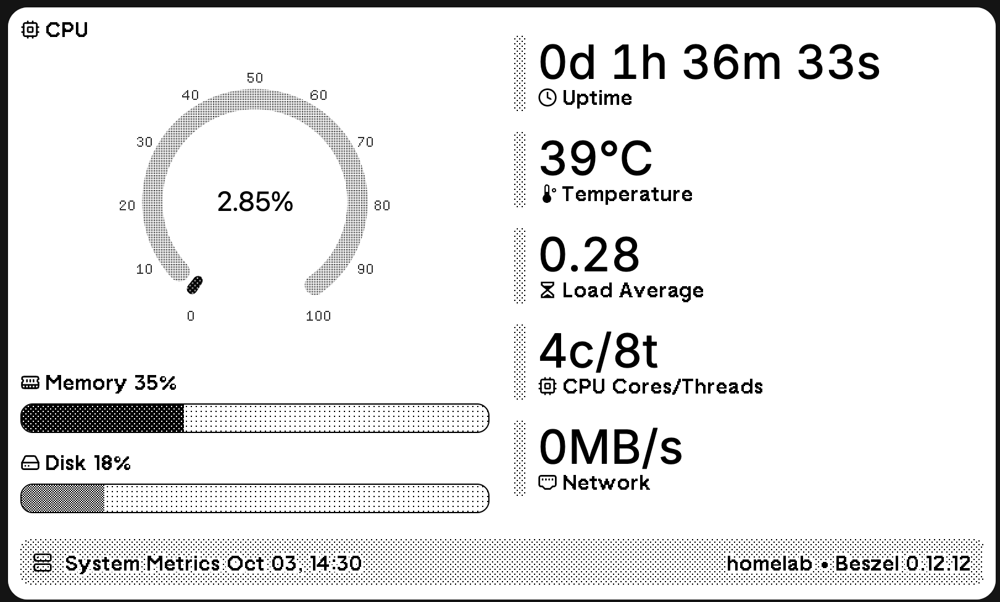
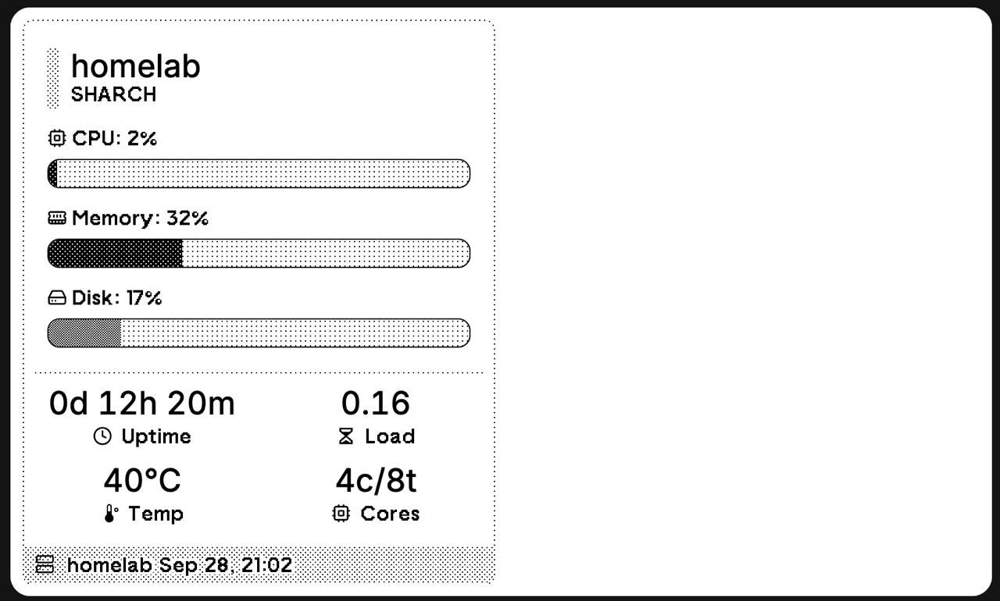

# TRMNL Beszel System Metrics Plugin


A TRMNL plugin that displays real-time system metrics from [Beszel monitoring](https://github.com/henrygd/beszel) via PocketBase. This plugin shows CPU, memory, disk usage, load averages, uptime, and other system information on your TRMNL e-ink display.

## Features

- ️ Real-time system metrics from Beszel monitoring
- ️ CPU, Memory, Disk usage with load averages
- ️ System uptime and temperature monitoring
- ️ Container tracking and network bandwidth
- ️ Multiple view templates for different display sizes
- ️ Automatic updates every 5 minutes via cron scheduling
- `GET /` Endpoint - System metrics in TRMNL format


## Installation

### Setup

1. **Clone and Install**:
  ```bash
  git clone https://github.com/yazdipour/trmnl-beszel.git
  cd trmnl-beszel/

  # Using Docker (recommended)
  docker-compose up -d

  # Or direct Node.js
  cd src && npm start && npm install
  ```

2. **Environment Setup** - Create `.env` in `src/` directory:
  ```bash
  POCKETBASE_URL=http://your-pocketbase-url:port/
  POCKETBASE_EMAIL=your-email@example.com
  POCKETBASE_PASSWORD=your-password
  PRIVATE_PLUGIN_URL=https://usetrmnl.com/api/custom_plugins/your-plugin-id
  PORT=3000
  ```

## Automatic Updates

The server automatically sends updated metrics to your TRMNL plugin every 5 minutes when `PRIVATE_PLUGIN_URL` is configured. This ensures your e-ink display always shows fresh system data without manual intervention.

- **Schedule**: Every 5 minutes (configurable in code)
- **Requirement**: Valid `PRIVATE_PLUGIN_URL` in environment variables
- **Fallback**: Manual updates via `GET /` endpoint

## TRMNL Setup
1. Deploy the API server
2. Create a custom plugin on TRMNL
3. Copy the liquid templates to your plugin

## Project Structure

```
├── docker-compose.yml    # Docker deployment
├── liquid/              # TRMNL templates
│   ├── *.liquid
│   └── shared.liquid
└── src/                # API server
    ├── server.js
    └── package.json

## Dependencies

- **express**: Web server framework
- **pocketbase**: PocketBase SDK for data access
- **node-cron**: Task scheduling for automatic updates
- **dotenv**: Environment variable management
```

## Screenshots






## Related Projects

- [Beszel](https://github.com/henrygd/beszel) - Server monitoring
- [TRMNL](https://usetrmnl.com/) - E-ink displays

## License

MIT License